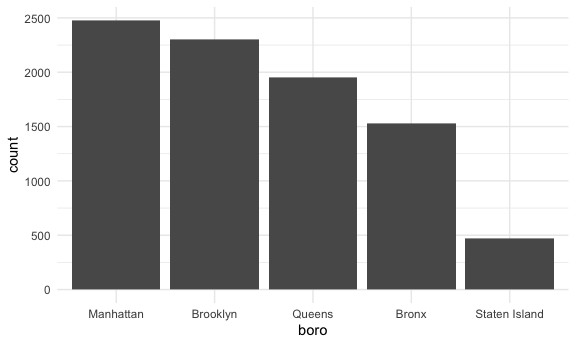

Strings and Factors
================
Elaine Yanxi Chen

## String vectors

`str_detect` does not look for a complete match.

``` r
string_vec = c("my", "name", "is", "jeff")

str_detect(string_vec, "jeff")
```

    ## [1] FALSE FALSE FALSE  TRUE

``` r
str_replace(string_vec, "jeff", "Jeff")
```

    ## [1] "my"   "name" "is"   "Jeff"

``` r
str_replace(string_vec, "m", "M")
```

    ## [1] "My"   "naMe" "is"   "jeff"

``` r
string_vec = c(
  "i think we all rule for participating",
  "i think i have been caught",
  "i think this will be quite fun actually",
  "it will be fun, i think"
  )

str_detect(string_vec, "^i think")
```

    ## [1]  TRUE  TRUE  TRUE FALSE

``` r
str_detect(string_vec, "i think$")
```

    ## [1] FALSE FALSE FALSE  TRUE

When you would need to use regular expression?

There is the phrase “i think” in all four instances. “^” is the
beginning of things “\$” indicate the end of the line

Use when variable names have specific prefixes or suffixes

``` r
string_vec = c(
  "Y'all remember Pres. HW Bush?",
  "I saw a green bush",
  "BBQ and Bushwalking at Molonglo Gorge",
  "BUSH -- LIVE IN CONCERT!!"
  )

str_detect(string_vec, "[Bb]ush")
```

    ## [1]  TRUE  TRUE  TRUE FALSE

Upper case or lower case b both would satisfy. Anything in this “\[\]”
would be identified.

``` r
string_vec = c(
  '7th inning stretch',
  '1st half soon to begin. Texas won the toss.',
  'she is 5 feet 4 inches tall',
  '3AM - cant sleep :('
  )

str_detect(string_vec, "[0-9][a-zA-Z]")
```

    ## [1]  TRUE  TRUE FALSE  TRUE

Number followed by a letter or more than one letter.

``` r
string_vec = c(
  'Its 7:11 in the evening',
  'want to go to 7-11?',
  'my flight is AA711',
  'NetBios: scanning ip 203.167.114.66'
  )

str_detect(string_vec, "7.11")
```

    ## [1]  TRUE  TRUE FALSE  TRUE

Detect anything at all between 7 and 11.

``` r
string_vec = c(
  'The CI is [2, 5]',
  ':-]',
  ':-[',
  'I found the answer on pages [6-7]'
  )

str_detect(string_vec, "\\[[0-9]")
```

    ## [1]  TRUE FALSE FALSE  TRUE

How to search for an actual dot? search for a special character with
“\\\[” while “\\\[\[0-9\]” search for a bracket and a number.

## Why factors are weird

``` r
factor_vec = factor(c("male", "male", "female", "female"))

as.numeric(factor_vec)
```

    ## [1] 2 2 1 1

``` r
factor_vec = fct_relevel(factor_vec, "male")
as.numeric(factor_vec)
```

    ## [1] 1 1 2 2

## NSDUH

``` r
nsduh_url = "http://samhda.s3-us-gov-west-1.amazonaws.com/s3fs-public/field-uploads/2k15StateFiles/NSDUHsaeShortTermCHG2015.htm"

table_marj = 
  read_html(nsduh_url) %>% 
  html_table() %>% 
  first() %>% 
  slice(-1)
```

tidy up the NSDUH data …

``` r
marj_df = 
  table_marj %>% 
  select(-contains("P value")) %>% 
  pivot_longer(
    -State,
    names_to = "age_year",
    values_to = "percent"
  ) %>% 
  separate(age_year, into = c("age", "year"), sep = "\\(") %>% 
  mutate(
    percent = str_replace(percent, "[a-b]$", ""),
    percent = as.numeric(percent),
    year = str_replace(year, "\\)", "")
  ) %>% 
  filter(
    !(State %in% c("Total U.S.", "Northeast", "Midwest", "South", "West", "District of Columbia"))
  )
```

``` r
marj_df %>% 
  filter(age == "12-17") %>% 
  mutate(State = fct_reorder(State, percent)) %>% 
  ggplot(aes(x = State, y = percent, color = year)) +
  geom_point() + 
  theme(axis.text.x = element_text(angle = 90, vjust = 0.5, hjust = 1))
```


## Restaurant inspections …

``` r
data("rest_inspec")
```

``` r
rest_inspec
```

    ## # A tibble: 397,584 × 18
    ##    action             boro  building  camis critical_flag cuisine_descrip… dba  
    ##    <chr>              <chr> <chr>     <int> <chr>         <chr>            <chr>
    ##  1 Violations were c… MANH… 425      4.15e7 Not Critical  Italian          SPIN…
    ##  2 Violations were c… MANH… 37       4.12e7 Critical      Korean           SHIL…
    ##  3 Violations were c… MANH… 15       4.11e7 Not Critical  Café/Coffee/Tea CITY…
    ##  4 Violations were c… MANH… 35       4.13e7 Critical      Korean           MADA…
    ##  5 Violations were c… MANH… 1271     5.00e7 Critical      American         THE …
    ##  6 Violations were c… MANH… 155      5.00e7 Not Critical  Donuts           DUNK…
    ##  7 Violations were c… MANH… 1164     5.00e7 Critical      Salads           SWEE…
    ##  8 Violations were c… MANH… 37       4.12e7 Not Critical  Korean           SHIL…
    ##  9 Violations were c… MANH… 299      5.01e7 Not Critical  American         PRET…
    ## 10 Violations were c… MANH… 53       4.04e7 Not Critical  Korean           HAN …
    ## # … with 397,574 more rows, and 11 more variables: inspection_date <dttm>,
    ## #   inspection_type <chr>, phone <chr>, record_date <dttm>, score <int>,
    ## #   street <chr>, violation_code <chr>, violation_description <chr>,
    ## #   zipcode <int>, grade <chr>, grade_date <dttm>

``` r
rest_inspec %>% 
  group_by(boro, grade) %>% 
  summarize(n_obs = n()) %>% 
  pivot_wider(
    names_from = grade, 
    values_from = n_obs
  )
```

    ## `summarise()` has grouped output by 'boro'. You can override using the
    ## `.groups` argument.

    ## # A tibble: 6 × 8
    ## # Groups:   boro [6]
    ##   boro              A     B     C `Not Yet Graded`     P     Z  `NA`
    ##   <chr>         <int> <int> <int>            <int> <int> <int> <int>
    ## 1 BRONX         13688  2801   701              200   163   351 16833
    ## 2 BROOKLYN      37449  6651  1684              702   416   977 51930
    ## 3 MANHATTAN     61608 10532  2689              765   508  1237 80615
    ## 4 Missing           4    NA    NA               NA    NA    NA    13
    ## 5 QUEENS        35952  6492  1593              604   331   913 45816
    ## 6 STATEN ISLAND  5215   933   207               85    47   149  6730

``` r
rest_inspec =
  rest_inspec %>% 
  filter(grade %in% c("A", "B", "C"), boro != "Missing") %>% 
  mutate(boro = str_to_title(boro))
  
rest_inspec %>% 
  group_by(boro, grade) %>% 
  summarize(n_obs = n()) %>% 
  pivot_wider(
    names_from = grade, 
    values_from = n_obs
  )
```

    ## `summarise()` has grouped output by 'boro'. You can override using the
    ## `.groups` argument.

    ## # A tibble: 5 × 4
    ## # Groups:   boro [5]
    ##   boro              A     B     C
    ##   <chr>         <int> <int> <int>
    ## 1 Bronx         13688  2801   701
    ## 2 Brooklyn      37449  6651  1684
    ## 3 Manhattan     61608 10532  2689
    ## 4 Queens        35952  6492  1593
    ## 5 Staten Island  5215   933   207

Let’s find pizza places …

``` r
rest_inspec %>% 
  filter(str_detect(dba, "[Pp][Ii][Zz][Zz][Aa]")) %>% 
  mutate(boro = fct_infreq(boro)) %>% 
  ggplot(aes(x = boro)) + 
  geom_bar()
```



``` r
rest_inspec %>% 
  filter(str_detect(dba, "[Pp][Ii][Zz][Zz][Aa]")) %>% 
  mutate(
    boro = fct_infreq(boro), 
    boro = fct_recode(boro, "The City" = "Manhattan")) %>% 
  ggplot(aes(x = boro)) + 
  geom_bar()
```


